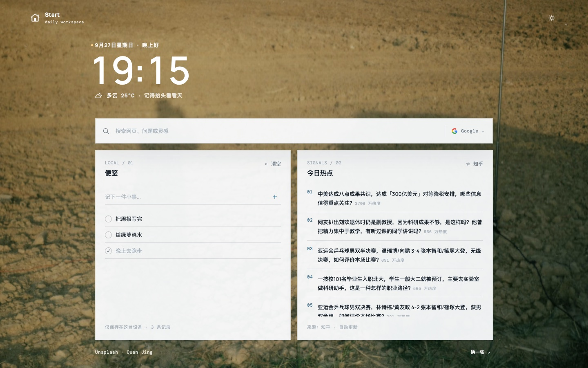
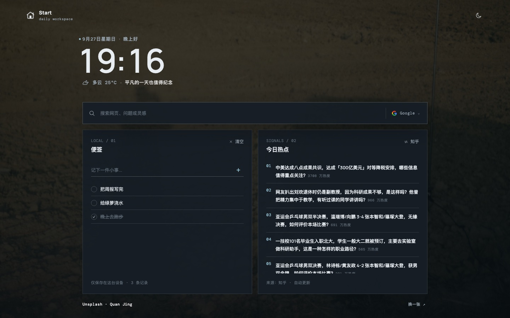
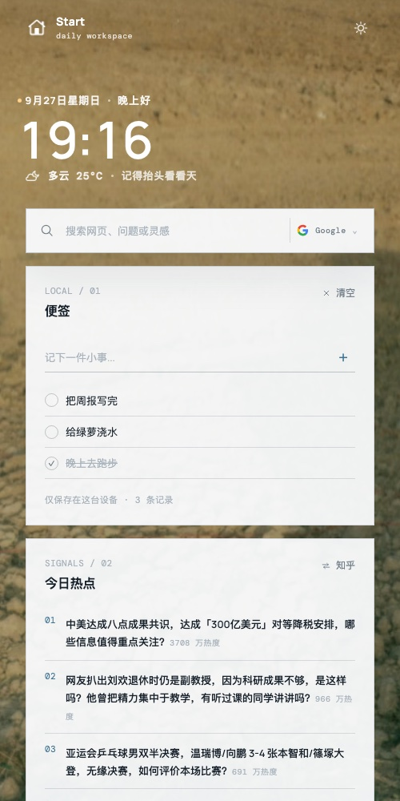
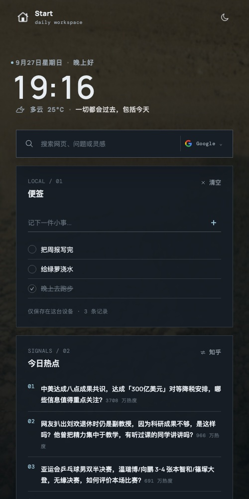
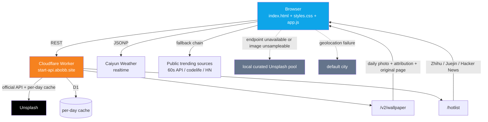

<p align="center"><a href="./README.md">简体中文</a> | <b>English</b></p>

<div align="center">

# Start · Daily Workspace

**A browser start page that's ready the moment you open it. Pure static, zero dependencies, zero build.**

Clock · Weather · Daily photo · Trending lists · Sticky notes — everything in place, on a single screen.

[**start.abobb.com**](https://start.abobb.com) &nbsp;·&nbsp; [start.abobb.site](https://start.abobb.site) &nbsp;·&nbsp; [Issues](https://github.com/abobb414/Startpage/issues)

[](./LICENSE)
[](#quick-start)
[](#tech-stack)
[](#performance)
[](#testing)
[](#tech-stack)

</div>

---

## Preview

<table>
<tr>
<td width="50%" align="center"><b>Light · Desktop</b><br/></td>
<td width="50%" align="center"><b>Dark · Desktop</b><br/></td>
</tr>
<tr>
<td width="50%" align="center"><b>Light · Mobile</b><br/></td>
<td width="50%" align="center"><b>Dark · Mobile</b><br/></td>
</tr>
</table>

> The wallpaper changes automatically every day (official Unsplash API), and text colors invert automatically based on the wallpaper's brightness. The images above show actual renders of the same day in both themes on both screen types.

---

## Features

### 🕐 Everything on one screen, without the noise

| Module | Description |
|---|---|
| **Clock** | Monospaced digits, font size scales with the viewport. Optical alignment compensation when the leading digit changes, so `09:59 → 10:00` never shifts the whole block sideways |
| **Date & greeting** | Greeting switches by hour (Late night / Good morning / Good afternoon / Good evening) |
| **Random quote** | 50 literary quotes, **one drawn at random on every refresh** (sessionStorage avoids hitting the same quote on rapid reloads); drawn only once at startup — clicking "Shuffle" won't replace it |
| **Weather** | Caiyun (ColorfulClouds) live weather; on geolocation failure it falls back to the default city with the **downgrade reason explicitly stated**; includes apparent temperature and humidity |
| **Today's trending** | Zhihu / Juejin / Hacker News, three sources with one-click switching, with hotness scores |

### 🔍 Search

Switch freely between four engines (Google · Bing · DuckDuckGo · Baidu); the icons are each engine's **official original assets** (sources listed in [`assets/engines/SOURCES.txt`](./assets/engines/SOURCES.txt)). Your choice is remembered; hit Enter to search.

### 📝 Sticky notes

Local sticky notes — written and saved, up to 12. **Stored only on this machine** (localStorage); no network calls, no accounts.
The storage layer does full dirty-data sanitization — a key corrupted by external writes won't crash the page (see [Engineering Notes](#engineering-notes-pitfalls-we-hit)).

### 🌗 Theme

By default the theme switches automatically, **following the sunrise/sunset at your location**, using the simplified solar position algorithm from SunCalc / NOAA — pure computation, zero network, zero dependencies. Light mode kicks in 30 minutes before sunrise (civil dawn) and dark mode 30 minutes after sunset (end of civil twilight): switching at the exact second of sunrise/sunset would turn the screen white before the sky is fully bright, and black while there's still daylight left. Hover the theme button to see the computed sunrise/sunset times for the day and where the coordinates came from.

**Where the coordinates come from** (this decides which "local" the theme actually follows; being off by one city can mean being off by half an hour):

| Priority | Source | Accuracy | Cost |
|---|---|---|---|
| ① | Browser geolocation | Meter-level | Requires user consent |
| ② | IP-based lookup | City-level | No consent needed; result cached for 12 hours |
| ③ | Built-in default city | —— | Last resort; the tooltip will explicitly say "default city" |

> ⚠️ IP-based lookup **must use endpoints reachable directly from mainland China**. Many users (including the machine this project was built on) hand international traffic to a proxy, and an overseas IP endpoint only sees the proxy's exit country — computing sunrise/sunset from those coordinates means switching themes on another hemisphere's schedule. So beyond picking a domestically reachable endpoint, there's also a **timezone sanity check**: if the browser timezone is in a Chinese-locale region but the IP geolocates overseas, the result is discarded outright. This path is verified by real measurement: at 18:30 on the same day, Yangquan, Shanxi was still in light mode while the default Shanghai coordinates had already switched to dark (Shanghai's sunset is 31 minutes earlier).

**Manual switching only lasts for the current browsing session**: clicking the theme button flips directly between light/dark (toggles relative to what's currently shown, so every click produces a visible change) and **does not write to localStorage**; refresh the page and you're back to automatic, re-judged from the current location and time. After crossing sunrise/sunset, the automatic switch is checked once per minute and stays out of the way while manual mode is active. On switch, `theme-color` is updated too, so the mobile browser's top bar color follows along.

The button's `title` only says what the current color is + today's local sunrise/sunset times + where the coordinates came from; the `aria-label` only says what it does — **it doesn't explain manual / automatic / what a refresh does**: those behaviors are self-evident and don't need restating on the button.

> An earlier version "permanently locked on a single click" (written to localStorage), with no way in the UI to return to automatic — one casual click and the page would never follow sunrise/sunset again. Along the way we tried a tri-state ring and a badge indicator; the final call was the simplest: **manual mode doesn't persist** (refresh returns to automatic), **no badge**, **and the copy doesn't explain any of this**.

### 🖼️ Wallpaper

- **Sourced only from Unsplash**: served via the self-hosted Worker's `/v2/wallpaper`; the server fetches the day's photo through the official Unsplash API and caches it per day
- **Proper attribution**: the footer shows the photographer / Unsplash name and links straight to the original photo page on Unsplash
- **"Shuffle"**: steps backward along the date axis (offset `-1 → -29`, then wraps back to today); the key space is limited, so mashing the button can't burn through the API quota
- **Brightness-adaptive text**: canvas samples the wallpaper's luminance under the greeting area and the footer area, then automatically decides whether text uses dark or light

---

## Engineering Notes: Pitfalls We Hit

This project is a little over 1,200 lines of code, but a good chunk of those lines went into **places that look unimportant and turn out to be fatal**. Every entry below was genuinely hit:

<table>
<tr><th width="30%">Symptom</th><th width="70%">Root cause &amp; fix</th></tr>
<tr>
<td><b>On iOS, text floats in front of Safari's bottom toolbar</b></td>
<td>The root cause is <b>not layout</b> — it's Safari's scroll position restoration: a start-page tab stays open, and on refresh the browser scrolls back to the last position, at which point the bottom bar is in its "collapsed pill" state, floating above the content.<br/>The fix is to always start from the top — <code>history.scrollRestoration = 'manual'</code>, and force back-to-top on bfcache restores too (<code>pageshow</code> + <code>persisted</code>).</td>
</tr>
<tr>
<td><b>The footer can't win the correct stacking level</b></td>
<td>The footer must be <code>position: relative</code> + <code>z-index</code> — <b>not</b> a <code>fixed</code> floating bar (text scrolls out from behind the translucent strip and overlaps the toolbar), and the z-index can't be dropped either (in light mode the whole bar gets buried under the wallpaper).</td>
</tr>
<tr>
<td><b>The wallpaper moves during iOS rubber-band scrolling</b></td>
<td>The fullscreen fixed layer is <b>anchored only to the top with a fixed height</b> (<code>calc(100vh + 280px)</code>). Anchoring both ends (setting top/bottom together) + <code>height:auto</code> gets stretched by the viewport changes as the toolbars collapse and expand.</td>
</tr>
<tr>
<td><b>Dark mode "flickering"</b></td>
<td>The old code force-refreshed by "changing <code>theme-color</code> and then changing it back," and auto mode called it every minute — the toolbar flashed along, over and over.<br/>Fix: delete the hack, and <b>don't touch the DOM when the value hasn't changed</b> (rebuilding the meta node makes WebKit re-read the toolbar color).</td>
</tr>
<tr>
<td><b>"Follow sunrise/sunset" silently stops working</b></td>
<td>Two pitfalls, neither of which throws an error:<br/>① <b>One click and you can never get back to automatic</b> — in the old version, clicking the theme button <b>persisted the lock</b>; there was no way in the UI to return to auto, so a single click cost the user the feature forever. Along the way we tried a tri-state ring, and a badge indicator for the auto state; the final call was the simplest: <b>manual switches don't persist</b> — they live only in the current browsing session, and a refresh returns to automatic (which also clears the lock value left behind by the old version). The button's <code>title</code> / <code>aria-label</code> state "currently manual, refresh to return to automatic," instead of expressing the state with a badge.<br/>② <b>The coordinates are actually the proxy's exit country</b> — when international traffic is handed to a proxy, an overseas IP endpoint returns the proxy's country, and the theme switches on another hemisphere's schedule. Fix: use a domestically reachable endpoint + a <b>timezone sanity check</b> (if the timezone is in a Chinese-locale region but the IP is overseas, discard the whole chain); better to fall back to the default city than to compute sunrise/sunset from wrong coordinates.</td>
</tr>
<tr>
<td><b>The wallpaper displays, but text brightness adaptation silently fails</b></td>
<td><code>picsum.photos</code> 302-redirects to <code>fastly.picsum.photos</code>, and the final response has <b>no <code>access-control-allow-origin</code></b> (only <code>timing-allow-origin</code>); the <code>crossOrigin</code> load fails → canvas can't read pixels → the text color freezes at the previous image's verdict, and a dark image paired with dark text simply can't be seen.<br/>Fix: an <code>isSampleable()</code> gate — only images from <code>images.unsplash.com</code> are accepted.</td>
</tr>
<tr>
<td><b>Greeting text sits on a dark image and simply can't be seen</b></td>
<td>Auto-picking the text color from the wallpaper's brightness hides three chained pitfalls; the first two each flip the verdict on their own:<br/>① <b>Coordinate system</b> — sampling must align with <b>the wallpaper layer's own box</b> (<code>position:fixed; top:-140px; height:calc(100vh + 280px)</code>), not the viewport. CSS <code>cover</code> is computed against that box; cropping with the viewport's aspect ratio shifts everything sideways by over a hundred pixels — the greeting sat squarely on a dark wave, but the sample came from a beige bright patch beside it.<br/>② <b>Horizontal extent</b> — a block element's <code>getBoundingClientRect()</code> returns the <b>full container column width</b> (stretching to 1030px); you must use <code>Range.selectNodeContents()</code> to measure the segment the text <b>actually</b> occupies.<br/>③ <b>The criterion</b> — the final call was <b>area-average luminance, one of two colors</b>: the greeting area and the footer are sampled independently; average relative luminance ≥ <code>0.45</code> gets one solid pure-black text block, otherwise one solid pure-white block, <b>with no shadows or outlines at all</b>. Two earlier versions were rejected: "bright-pixel ratio ≥ 75%" judged dark patches as light backgrounds on photos with mixed lighting, and dark text on them vanished completely; "per-pixel WCAG contrast scoring" was finer in theory, but on mid-tone photos both text colors had large unreadable regions that no score could rescue — since the product only allows "one solid color for the whole block," the mean plus two extreme text colors is in fact the most robust, most predictable choice.</td>
</tr>
<tr>
<td><b>Text color gets crossed after rapid "Shuffle" clicks</b></td>
<td>Two samples coexisted, and a late-arriving old result overwrote the new image's verdict. The callback must verify <code>target === lastWallpaperUrl</code>, otherwise it's discarded.</td>
</tr>
<tr>
<td><b>One bad key paralyzes the whole page</b></td>
<td>Everything read out of localStorage is sanitized as <b>untrusted input</b> (<code>readArray</code> / <code>readNumber</code> / <code>safeUrl</code>). A corrupted <code>notes</code> key once made the notes module throw, which took down <b>all</b> subsequent initialization — trending lists blank, weather stuck on "loading" forever, wallpaper never loading.<br/>At the same time, all async init tasks run through <code>runAsync</code> in isolation from each other; any one failing doesn't affect the others.</td>
</tr>
<tr>
<td><b><code>javascript:</code> injection</b></td>
<td>Trending-list data comes from third-party endpoints; links must pass a protocol whitelist (<code>safeUrl</code>), and there's a second check at the render boundary — a render function must never assume its caller already sanitized the input.</td>
</tr>
<tr>
<td><b>Waiting in vain for three slow endpoints</b></td>
<td>The trending fallback order is <b>own API → public sources</b>, and the own API carries a short 6-second timeout. Getting the order backwards means every load waits on the public sources for nothing.</td>
</tr>
<tr>
<td><b>Edge vignettes added for the iOS toolbar — the whole layer was eventually deleted</b></td>
<td>Two <code>position: fixed</code> gradient layers used to dim text as it scrolled to the top/bottom edges, so it would be less readable under the glass of the iOS status bar and the bottom pill. The problem: it could <b>never achieve "completely invisible"</b> — too light did nothing, too heavy was just two gray bands, and repeatedly tweaking opacity and height only moved between the two bad outcomes.<br/>The layer was <b>deleted entirely</b> once iOS Safari was no longer an adaptation target (two divs in <code>index.html</code> + one CSS section). Before deleting, a visual regression pass was run — desktop / mobile × light / dark + <b>scrolled to mid-page</b> — with no anomalies at either edge.</td>
</tr>
<tr>
<td><b>The "geolocation stub" in the tests never actually took effect</b></td>
<td><code>navigator.geolocation</code> is an <b>accessor property (getter only)</b> defined on <code>Navigator.prototype</code>; in non-strict mode, writing <code>navigator.geolocation = {…}</code> <b>neither errors nor takes effect</b> — so the tests kept calling the real system location service: fast scenarios got weather fine, slow scenarios stayed on "loading weather" forever. The symptom was "a different scenario fails every round," which is easily mistaken for environment flakiness and papered over by re-running.<br/>Fix: stub with <code>Object.defineProperty</code> across the board (<code>navigator.permissions.query</code> also hangs off the prototype, same treatment), plus a dedicated assertion checking that "the stub is actually in place."</td>
</tr>
<tr>
<td><b>Regression tests randomly report "the page crashed before assertions ran"</b></td>
<td>Tests run under <code>--virtual-time-budget</code>, and Chrome's virtual clock burns through the page's <code>setInterval</code> timers instantly; once the budget is exhausted it dumps the DOM immediately — but <b>loading external <code>&lt;script src&gt;</code> is not governed by the virtual clock</b>, so the scripts likely hadn't executed yet and what got captured was just raw HTML (clock still <code>--:--</code>, trending still a skeleton).<br/>Fix: the test harness injects <code>seed.js</code> / <code>app.js</code> / <code>test.js</code> and the styles <b>inline</b> into the page (executed on parse, no network round-trip), and the budget was raised from 20s to 60s. The results node also got a "write-as-it-runs" <b>heartbeat</b> — now, even if the DOM is dumped mid-run, you can see which assertion it last reached instead of a blanket "it crashed."</td>
</tr>
</table>

---

## Architecture



The design principle is that **every piece degrades independently** — no external dependency going down should ever turn the page into a blank screen:

- Trending lists: own API → public sources, falling back level by level
- Wallpaper: own API → local curated Unsplash pool
- Weather: geolocation → default city
- Theme: geolocation → IP lookup → default city — computed once upfront with whatever coordinates are at hand to avoid a "white-then-black" flash, then re-judged once real geolocation resolves asynchronously

> ⚠️ The backend (`start-abobb-api` Worker + D1) is a **separate Cloudflare project**, not part of this repository.

---

## Tech Stack

**No framework, no build, no dependencies.**

| | |
|---|---|
| Language | Vanilla JavaScript (ES2020+), modern CSS (custom properties / `clamp()` / `:root` state classes) |
| Styling | Single-file `styles.css`, hand-split into 14 numbered sections |
| Layout | CSS Grid + a little Flex; responsive scaling without breakpoints |
| Fonts | Self-hosted `woff2` (Manrope + DM Mono), no external font requests |
| Backend | Cloudflare Worker + D1 (separate project) |
| Deployment | Vercel (static hosting, global CDN) |

### Performance

| File | Raw | gzip |
|---|---:|---:|
| `index.html` | 5,877 B | 2,159 B |
| `styles.css` | 17,888 B | 5,969 B |
| `app.js` | 45,406 B | 17,932 B |
| **Total** | **69,171 B** | **26,060 B** |

Zero third-party JS dependencies, zero build steps. The first paint only needs three files — HTML + CSS + JS; fonts and engine icons are all self-hosted static assets.

---

## Quick Start

Nothing to install — after `git clone`, just start a static server:

```bash
git clone https://github.com/abobb414/Startpage.git
cd Startpage
python3 -m http.server 8080
# open http://127.0.0.1:8080
```

> **Note**: the own Worker's CORS whitelist only allows `start.abobb.com` / `start.abobb.site`, so in local preview the trending lists and wallpaper go through the **fallback chain** (public trending sources + the local curated Unsplash pool). That's expected behavior — and it doubles as a check that the fallbacks actually work.

---

## Testing

Comes with an automated headless-Chrome regression suite — **10 scenarios, 541 assertions** — covering the happy path and every failure path:

| Scenario | What it covers |
|---|---|
| `default` | First paint loads normally, all modules render fully |
| `cached` | The localStorage cache-hit branch |
| `dirty` | Page doesn't crash when storage is corrupted (non-arrays, non-numbers, invalid URLs) |
| `public` | Own API down → fallback to public sources |
| `offline` | Fully offline (all domains blocked via `--host-resolver-rules`) |
| `interactive` | Theme switching, engine switching, adding/removing notes, switching trending sources, changing wallpaper |
| `wpfail` | Wallpaper API fails → local curated pool |
| `picfail` | Wallpaper image fails to load → notice and retry |
| `assets` | The four icon declarations (7-size ICO / SVG / 1024 PNG / 180 touch icon) and content fingerprints |
| `ipcross` | IP geolocates overseas (proxied exit) → blocked by the timezone sanity check, coordinates stay on the default city |
| `search` | Enter-to-search navigates to the correct target URL |

```bash
cd tests
./run.sh                  # run all 10 scenarios
./run.sh dirty offline    # run only the given scenarios
```

The harness drives the real page by injecting `seed.js` (before `app.js` — stubs `fetch` / JSONP / seeds localStorage) and `test.js` (after `app.js` — runs the assertion set), rather than mocking the DOM. **Because it tests real code, it catches real bugs** — the first baseline run surfaced 8 defects that had been lurking all along.

---

## Directory Structure

```
.
├── index.html                  # 68 lines, semantic markup
├── styles.css                  # 244 lines, 14 numbered sections
├── app.js                      # 863 lines, 13 numbered sections
├── assets/
│   ├── engines/                # official icons of the four search engines (+ SOURCES.txt with attribution)
│   ├── fonts/                  # self-hosted woff2 (Manrope + DM Mono)
│   └── brand-home.png
├── tests/                      # headless-browser regression harness (see tests/README.md)
├── docs/                       # README preview images
├── favicon.svg                 # embedded 128px bitmap (not traced; same source and version as ICO/PNG)
├── favicon.png / .ico          # 1024×1024 PNG + 16→256 seven-size ICO (both proportionally scaled from the native 1600px icons8 source)
├── apple-touch-icon.png        # 180×180, iOS home-screen icon (opaque #f4f6f8 background)
└── robots.txt
```

`app.js` is split into 13 sections in dependency order; just read it top to bottom:

```
1. Startup timing      Scroll position restoration strategy
2. Config              API base URLs / data sources / wallpaper pool / search engines
3. Storage layer       localStorage read/write + dirty-data sanitization
4. DOM references
5. Utilities           dates, fetch with timeout, JSONP
6. Clock & greeting
7. Sticky notes
8. Search
9. Trending lists      own API → public sources, degrading level by level
10. Weather            Caiyun JSONP
11. Wallpaper          Unsplash daily photo + brightness-adaptive text
12. Theme              follows sunrise/sunset / manual (current session only; refresh returns to auto)
13. Event bindings & startup
```

---

## Browser Support

Primary targets are **Chromium-based browsers** (Chrome / Edge / Arc, including Android builds) and **desktop Safari**.

Early on, **iOS Safari** was treated as a first-class adaptation target, with plenty of special handling for its rubber-band scrolling, collapsing toolbars, and bfcache restores — but that engine's toolbar behavior changes from release to release, many issues can only be solved by trial and error, and fixes often broke one thing while repairing another. The project now **does no special adaptation for iOS Safari**: the related hacks have been removed, and on it the page only guarantees "usable and crash-free," not pixel-level parity. The iOS entries kept in the table above are historical experience and still worth referencing.

Requires ES2020+, CSS custom properties, `Intl.DateTimeFormat`, and `canvas`. IE is not supported, and won't be.

---

## License

[AGPL-3.0](./LICENSE)

<div align="center"><sub>Wallpaper photos come from <a href="https://unsplash.com/?utm_source=abobb_startpage&utm_medium=referral">Unsplash</a>, used under their license terms and credited in the footer.</sub></div>
