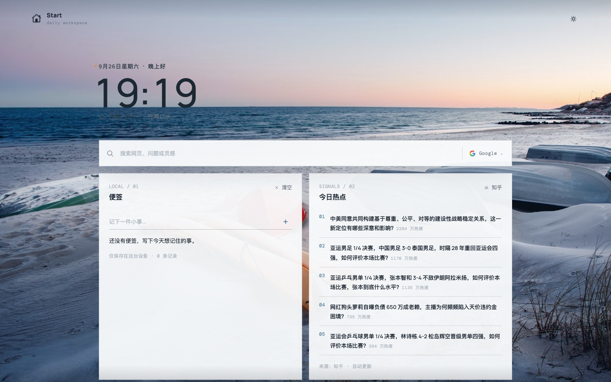
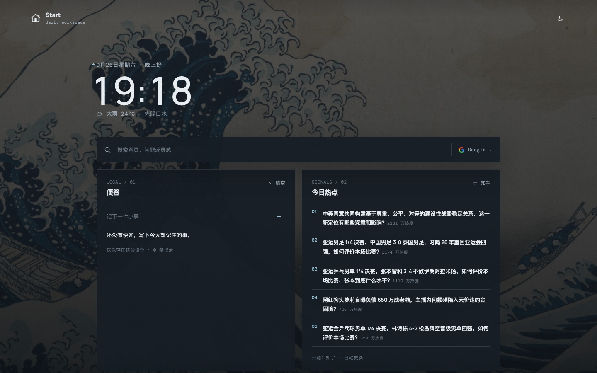
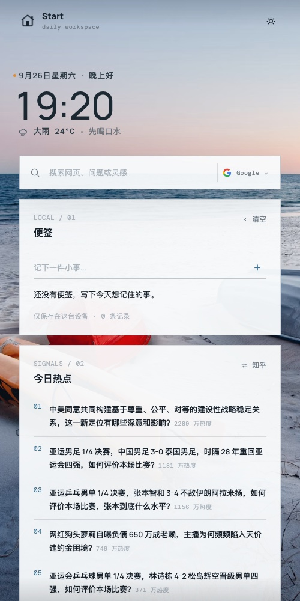
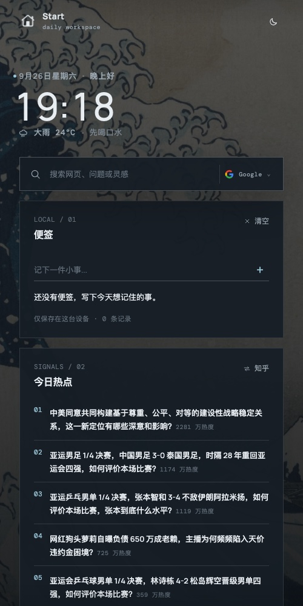
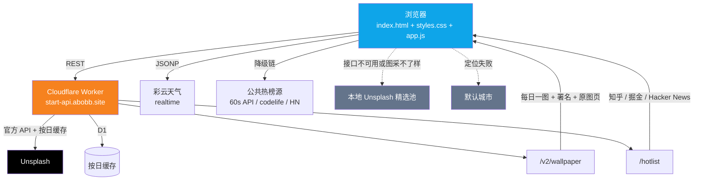

<div align="center">

# Start · Daily Workspace

**打开就用的浏览器起始页。纯静态、零依赖、零构建。**

时钟 · 天气 · 每日一图 · 热榜 · 便签 —— 一屏之内，全部到位。

[**start.abobb.com**](https://start.abobb.com) &nbsp;·&nbsp; [start.abobb.site](https://start.abobb.site) &nbsp;·&nbsp; [Issues](https://github.com/abobb414/Startpage/issues)

[](./LICENSE)
[](#快速开始)
[](#技术栈)
[](#性能)
[](#测试)
[](#技术栈)

</div>

---

## 预览

<table>
<tr>
<td width="50%" align="center"><b>浅色 · 桌面</b><br/></td>
<td width="50%" align="center"><b>深色 · 桌面</b><br/></td>
</tr>
<tr>
<td width="50%" align="center"><b>浅色 · 移动端</b><br/></td>
<td width="50%" align="center"><b>深色 · 移动端</b><br/></td>
</tr>
</table>

> 壁纸每日自动更换（Unsplash 官方 API），文字颜色会根据壁纸明暗自动反转。上图为同一天在两种主题、两种屏幕下的实际渲染。

---

## 特性

### 🕐 一屏之内，信息不吵

| 模块 | 说明 |
|---|---|
| **时钟** | 等宽数字排版，字号随视口缩放。首位数字变化时做了光学对齐补偿，`09:59 → 10:00` 整块数字不会横移 |
| **日期与问候** | 按小时切换问候（夜深了 / 早上好 / 下午好 / 晚上好） |
| **每日短句** | 由日期决定，同一天在**所有设备上是同一句**；点「换一张」不会把它换掉 |
| **天气** | 彩云天气实况，定位失败自动回落默认城市，并**显式标注降级原因**；附带体感温度与湿度 |
| **今日热点** | 知乎 / 掘金 / Hacker News 三源一键切换，带热度值 |

### 🔍 搜索

四家引擎任意切换（Google · Bing · DuckDuckGo · 百度），图标为各家**官方原始资产**（来源见 [`assets/engines/SOURCES.txt`](./assets/engines/SOURCES.txt)）。选择会记住，回车即搜。

### 📝 便签

本地便签，写下就存，最多 12 条。**只存在本机**（localStorage），不出网、无账号。
存储层做了完整的脏数据清洗 —— 外部写坏的键不会让页面崩掉（见[工程笔记](#工程笔记那些踩过的坑)）。

### 🌗 主题

默认 **跟随所在地的日出日落** 自动切换，用的是 SunCalc / NOAA 的简化式太阳位置算法 —— 纯计算、零网络、零依赖，并留了 30 分钟晨昏缓冲（免得天还没亮屏幕先白）。

也可以手动锁定浅色 / 深色，锁定后不再自动变。切换时同步更新 `theme-color`，移动端浏览器的顶栏颜色会跟着走。

### 🖼️ 壁纸

- **来源只有 Unsplash**：走自建 Worker 的 `/v2/wallpaper`，服务端用 Unsplash 官方 API 取当日一图并按日缓存
- **署名合规**：页脚显示摄影者 / 馆方名，链接直达 Unsplash 原图页
- **「换一张」**：沿日期轴往前翻（offset `-1 → -29` 后绕回今天），键空间有限，随便点也刷不爆配额
- **明暗自适应**：canvas 采样壁纸在问候区与页脚区的亮度，自动决定文字用深色还是浅色

---

## 工程笔记：那些踩过的坑

这个项目 1121 行代码，但不少行数花在了**看起来不重要、实际会要命的地方**。以下每一条都是真实踩过的：

<table>
<tr><th width="30%">症状</th><th width="70%">根因与解法</th></tr>
<tr>
<td><b>iOS 上「字浮在 Safari 底部工具栏前面」</b></td>
<td>根因<b>不是布局</b>，是 Safari 的滚动位置恢复：起始页标签页常驻，刷新时自动滚回上次位置，此时底栏处于「收起胶囊」态、悬浮在内容之上。<br/>解法是每次从页首开始 —— <code>history.scrollRestoration = 'manual'</code>，并对 bfcache 恢复（<code>pageshow</code> + <code>persisted</code>）也强制回页首。</td>
</tr>
<tr>
<td><b>页脚抢不到正确层级</b></td>
<td>页脚必须是 <code>position: relative</code> + <code>z-index</code>，<b>不能</b>是 <code>fixed</code> 悬浮条（文字滚动时会从半透明条后面穿过并叠在工具栏上），也不能丢掉 z-index（浅色模式下整条会被壁纸盖住）。</td>
</tr>
<tr>
<td><b>iOS 回弹时壁纸跟着动</b></td>
<td>全屏 fixed 层<b>只锚定 top + 固定高度</b>（<code>calc(100vh + 280px)</code>）。双端锚定（top/bottom 同时设）+ <code>height:auto</code> 会被工具栏收展时的视口变化拉伸。</td>
</tr>
<tr>
<td><b>深色模式「抽风」</b></td>
<td>旧代码用「把 <code>theme-color</code> 改一下再改回来」强制刷新，而 auto 模式每分钟都会调用一次 —— 工具栏跟着反复闪。<br/>解法：删掉 hack，且<b>值没变就不动 DOM</b>（重建 meta 节点会让 WebKit 重读工具栏颜色）。</td>
</tr>
<tr>
<td><b>壁纸能显示，但文字明暗自适应静默失效</b></td>
<td><code>picsum.photos</code> 会 302 到 <code>fastly.picsum.photos</code>，最终响应<b>没有 <code>access-control-allow-origin</code></b>（只有 <code>timing-allow-origin</code>），<code>crossOrigin</code> 加载失败 → canvas 取不到像素 → 字色僵在上一张判定上，暗图配深字直接看不见。<br/>解法：<code>isSampleable()</code> 门禁，只采用 <code>images.unsplash.com</code> 的图。</td>
</tr>
<tr>
<td><b>竖屏手机上字色判反</b></td>
<td>采样裁剪必须用<b>当前视口的真实宽高比</b>。写死 16:9 时，竖屏手机会采到原图中间一条横带，跟它实际看到的画面毫无关系。采样带的位置同理 —— 要用元素<b>此刻在视口里的真实位置</b>，不能写死百分比。</td>
</tr>
<tr>
<td><b>连点「换一张」后字色串了</b></td>
<td>两次采样并存，迟到的旧结果覆盖了新图的判定。回调里必须确认 <code>target === lastWallpaperUrl</code>，否则作废。</td>
</tr>
<tr>
<td><b>一个坏键让整个页面瘫痪</b></td>
<td>localStorage 读出来的东西一律当<b>不可信输入</b>清洗（<code>readArray</code> / <code>readNumber</code> / <code>safeUrl</code>）。曾有一个被写坏的 <code>notes</code> 键让便签区抛错，连累后面<b>所有</b>初始化都不执行 —— 热点空白、天气永远「加载中」、壁纸不加载。<br/>同时所有初始化异步任务走 <code>runAsync</code> 彼此隔离，任何一块挂掉都不影响其他块。</td>
</tr>
<tr>
<td><b><code>javascript:</code> 注入</b></td>
<td>热点数据来自第三方接口，链接必须过协议白名单（<code>safeUrl</code>），且在渲染出口再兜一道 —— 渲染函数不能假设调用方一定清洗过。</td>
</tr>
<tr>
<td><b>白等三个慢接口</b></td>
<td>热点的降级顺序是<b>自有 API → 公共源</b>，且自有 API 带 6 秒短超时。顺序反了会让每次加载都白等公共源。</td>
</tr>
<tr>
<td><b>为 iOS 工具栏加的边缘晕影，最后整层删掉了</b></td>
<td>曾用两个 <code>position: fixed</code> 的渐变层把滚到屏幕上 / 下边缘的文字压暗，好让 iOS 状态栏与底部胶囊的玻璃底下不那么清晰可读。问题是它<b>永远做不到「完全看不见」</b>：调轻了毫无作用，调重了就是两条灰带，反复调透明度与高度只是在两个坏结果之间来回。<br/>最终因为不再把 iOS Safari 当适配目标而<b>整层删除</b>（<code>index.html</code> 两个 div + 一个 CSS 分区）。删之前做过桌面 / 手机 × 浅色 / 深色 + <b>滚动到中段</b>的视觉回归 —— 上下边缘没有任何异常。</td>
</tr>
</table>

---

## 架构



设计原则是**每一块都能独立降级**，任何外部依赖挂掉都不该让页面变成白屏：

- 热榜：自有 API → 公共源逐级回退
- 壁纸：自有 API → 本地 Unsplash 精选池
- 天气：定位 → 默认城市
- 主题：定位 → 默认城市坐标先算一次，避免「先白后黑」闪屏，真实定位异步补上后重判

> ⚠️ 后端（`start-abobb-api` Worker + D1）是**独立的 Cloudflare 项目**，不在本仓库内。

---

## 技术栈

**没有框架，没有构建，没有依赖。**

| | |
|---|---|
| 语言 | 原生 JavaScript（ES2020+）、现代 CSS（自定义属性 / `clamp()` / `:root` 状态类） |
| 样式 | 单文件 `styles.css`，手工切分为 15 个编号分区 |
| 布局 | CSS Grid + 少量 Flex，响应式无断点式缩放 |
| 字体 | 自托管 `woff2`（Manrope + DM Mono），无外部字体请求 |
| 后端 | Cloudflare Worker + D1（独立项目） |
| 部署 | Vercel（静态托管，全局 CDN） |

### 性能

| 文件 | 原始 | gzip |
|---|---:|---:|
| `index.html` | 5,984 B | 2,159 B |
| `styles.css` | 18,593 B | 6,269 B |
| `app.js` | 41,222 B | 16,392 B |
| **合计** | **65,799 B** | **23,844 B** |

零个第三方 JS 依赖，零次构建步骤。首屏只需拉取 HTML + CSS + JS 三个文件，字体与引擎图标均为自托管静态资源。

---

## 快速开始

无需安装任何东西，`git clone` 之后起一个静态服务器即可：

```bash
git clone https://github.com/abobb414/Startpage.git
cd Startpage
python3 -m http.server 8080
# 打开 http://127.0.0.1:8080
```

> **说明**：自有 Worker 的 CORS 白名单只放行 `start.abobb.com` / `start.abobb.site`，本地预览时热榜与壁纸会走**降级链路**（公共热榜源 + 本地 Unsplash 精选池）。这是预期行为，也顺便验证了降级可用。

---

## 测试

配了一套无头 Chrome 的自动化回归，**9 个场景、430 条断言**，覆盖正常路径与各种故障路径：

| 场景 | 覆盖内容 |
|---|---|
| `default` | 首屏正常加载，各模块渲染完整 |
| `cached` | 命中 localStorage 缓存的分支 |
| `dirty` | 存储被写坏（非数组、非数字、非法 URL）时页面不崩 |
| `public` | 自有 API 挂掉 → 公共源降级 |
| `offline` | 完全断网（`--host-resolver-rules` 屏蔽全部域名） |
| `interactive` | 主题切换、引擎切换、便签增删、热点换源、换壁纸 |
| `wpfail` | 壁纸接口失败 → 本地精选池 |
| `picfail` | 壁纸图加载失败 → 提示与重试 |
| `search` | 回车搜索的跳转目标地址正确 |

```bash
cd tests
./run.sh                  # 跑全部 9 个场景
./run.sh dirty offline    # 只跑指定场景
```

测试台通过注入 `seed.js`（`app.js` 之前，打桩 `fetch` / JSONP / 播种 localStorage）与 `test.js`（`app.js` 之后，跑断言集）来驱动真实页面，而不是模拟 DOM。**因为它测的是真代码，所以它抓到的都是真 bug** —— 首轮基线就抓出了 8 个此前一直潜伏的缺陷。

---

## 目录结构

```
.
├── index.html                  # 70 行，语义化标记
├── styles.css                  # 252 行，15 个编号分区
├── app.js                      # 799 行，13 个编号分区
├── assets/
│   ├── engines/                # 四家搜索引擎官方图标（+ SOURCES.txt 标注来源）
│   ├── fonts/                  # 自托管 woff2（Manrope + DM Mono）
│   └── brand-home.png
├── tests/                      # 无头浏览器回归测试台（详见 tests/README.md）
├── docs/                       # README 预览图
├── favicon.svg / .png / .ico
├── apple-touch-icon.png
└── robots.txt
```

`app.js` 按依赖顺序分成 13 个分区，从上往下读即可：

```
1. 启动时机      滚动位置还原策略
2. 配置          接口基址 / 数据源 / 壁纸池 / 搜索引擎
3. 存储层        localStorage 读写 + 脏数据清洗
4. DOM 引用
5. 通用工具      日期、带超时的 fetch、JSONP
6. 时钟与问候
7. 便签
8. 搜索
9. 今日热点      自有 API → 公共源逐级降级
10. 天气         彩云 JSONP
11. 壁纸         Unsplash 每日一图 + 明暗自适应
12. 主题         跟随日出日落 / 手动锁定
13. 事件绑定与启动
```

---

## 浏览器支持

以 **Chromium 内核浏览器**（Chrome / Edge / Arc，含 Android 版）与 **桌面版 Safari** 为主力目标。

早期曾把 **iOS Safari** 当作一等适配对象，为它的滚动回弹、工具栏收展、bfcache 恢复做了一堆专门处理 —— 但这个内核的工具栏行为随版本反复变化，很多问题只能靠试错，而且常常修好一处、弄坏另一处。现在**不再为 iOS Safari 做专门适配**：相关 hack 已经移除，页面在它上面只保证「能正常用、不崩」，不追求像素级一致。上表里保留的 iOS 条目是历史经验，仍有参考价值。

需要支持 ES2020+、CSS 自定义属性、`Intl.DateTimeFormat`、`canvas`。IE 不支持，也不打算支持。

---

## 许可

[AGPL-3.0](./LICENSE)

<div align="center"><sub>壁纸来自 <a href="https://unsplash.com/?utm_source=abobb_startpage&utm_medium=referral">Unsplash</a>，遵循其许可条款并在页脚署名。</sub></div>
