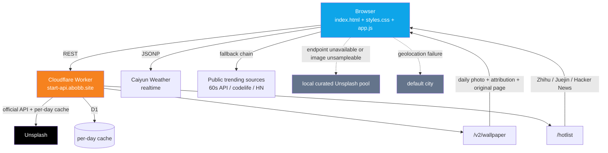
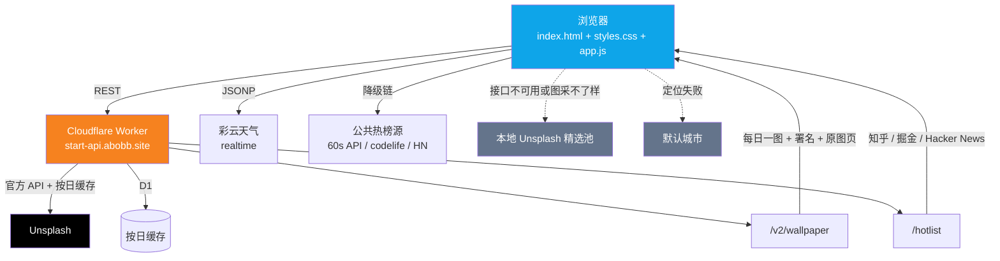

<div align="center">

# Start · Daily Workspace

**打开就用的浏览器起始页。纯静态、零依赖、零构建。**

时钟 · 天气 · 每日一图 · 热榜 · 便签 —— 一屏之内，全部到位。

[**start.abobb.com**](https://start.abobb.com) &nbsp;·&nbsp; [start.abobb.site](https://start.abobb.site) &nbsp;·&nbsp; [Issues](https://github.com/abobb414/Startpage/issues)

[](./LICENSE)
[](#快速开始)
[](#技术栈)
[](#性能)
[](#测试)
[](#技术栈)

</div>

<details>
<summary><b>English</b>（点击展开英文版 · Click to expand）</summary>

<div align="center">

# Start · Daily Workspace

**A browser start page that's ready the moment you open it. Pure static, zero dependencies, zero build.**

Clock · Weather · Daily photo · Trending lists · Sticky notes — everything in place, on a single screen.

[**start.abobb.com**](https://start.abobb.com) &nbsp;·&nbsp; [start.abobb.site](https://start.abobb.site) &nbsp;·&nbsp; [Issues](https://github.com/abobb414/Startpage/issues)

[](./LICENSE)
[](#quick-start)
[](#tech-stack)
[](#performance)
[](#testing)
[](#tech-stack)

</div>

---

## Preview

<table>
<tr>
<td width="50%" align="center"><b>Light · Desktop</b><br/></td>
<td width="50%" align="center"><b>Dark · Desktop</b><br/></td>
</tr>
<tr>
<td width="50%" align="center"><b>Light · Mobile</b><br/></td>
<td width="50%" align="center"><b>Dark · Mobile</b><br/></td>
</tr>
</table>

> The wallpaper changes automatically every day (official Unsplash API), and text colors invert automatically based on the wallpaper's brightness. The images above show actual renders of the same day in both themes on both screen types.

---

## Features

### 🕐 Everything on one screen, without the noise

| Module | Description |
|---|---|
| **Clock** | Monospaced digits, font size scales with the viewport. Optical alignment compensation when the leading digit changes, so `09:59 → 10:00` never shifts the whole block sideways |
| **Date & greeting** | Greeting switches by hour (Late night / Good morning / Good afternoon / Good evening) |
| **Random quote** | 50 literary quotes, **one drawn at random on every refresh** (sessionStorage avoids hitting the same quote on rapid reloads); drawn only once at startup — clicking "Shuffle" won't replace it |
| **Weather** | Caiyun (ColorfulClouds) live weather; on geolocation failure it falls back to the default city with the **downgrade reason explicitly stated**; includes apparent temperature and humidity |
| **Today's trending** | Zhihu / Juejin / Hacker News, three sources with one-click switching, with hotness scores |

### 🔍 Search

Switch freely between four engines (Google · Bing · DuckDuckGo · Baidu); the icons are each engine's **official original assets** (sources listed in [`assets/engines/SOURCES.txt`](./assets/engines/SOURCES.txt)). Your choice is remembered; hit Enter to search.

### 📝 Sticky notes

Local sticky notes — written and saved, up to 12. **Stored only on this machine** (localStorage); no network calls, no accounts.
The storage layer does full dirty-data sanitization — a key corrupted by external writes won't crash the page (see [Engineering Notes](#engineering-notes-pitfalls-we-hit)).

### 🌗 Theme

By default the theme switches automatically, **following the sunrise/sunset at your location**, using the simplified solar position algorithm from SunCalc / NOAA — pure computation, zero network, zero dependencies. Light mode kicks in 30 minutes before sunrise (civil dawn) and dark mode 30 minutes after sunset (end of civil twilight): switching at the exact second of sunrise/sunset would turn the screen white before the sky is fully bright, and black while there's still daylight left. Hover the theme button to see the computed sunrise/sunset times for the day and where the coordinates came from.

**Where the coordinates come from** (this decides which "local" the theme actually follows; being off by one city can mean being off by half an hour):

| Priority | Source | Accuracy | Cost |
|---|---|---|---|
| ① | Browser geolocation | Meter-level | Requires user consent |
| ② | IP-based lookup | City-level | No consent needed; result cached for 12 hours |
| ③ | Built-in default city | —— | Last resort; the tooltip will explicitly say "default city" |

> ⚠️ IP-based lookup **must use endpoints reachable directly from mainland China**. Many users (including the machine this project was built on) hand international traffic to a proxy, and an overseas IP endpoint only sees the proxy's exit country — computing sunrise/sunset from those coordinates means switching themes on another hemisphere's schedule. So beyond picking a domestically reachable endpoint, there's also a **timezone sanity check**: if the browser timezone is in a Chinese-locale region but the IP geolocates overseas, the result is discarded outright. This path is verified by real measurement: at 18:30 on the same day, Yangquan, Shanxi was still in light mode while the default Shanghai coordinates had already switched to dark (Shanghai's sunset is 31 minutes earlier).

**Manual switching only lasts for the current browsing session**: clicking the theme button flips directly between light/dark (toggles relative to what's currently shown, so every click produces a visible change) and **does not write to localStorage**; refresh the page and you're back to automatic, re-judged from the current location and time. After crossing sunrise/sunset, the automatic switch is checked once per minute and stays out of the way while manual mode is active. On switch, `theme-color` is updated too, so the mobile browser's top bar color follows along.

The button's `title` only says what the current color is + today's local sunrise/sunset times + where the coordinates came from; the `aria-label` only says what it does — **it doesn't explain manual / automatic / what a refresh does**: those behaviors are self-evident and don't need restating on the button.

> An earlier version "permanently locked on a single click" (written to localStorage), with no way in the UI to return to automatic — one casual click and the page would never follow sunrise/sunset again. Along the way we tried a tri-state ring and a badge indicator; the final call was the simplest: **manual mode doesn't persist** (refresh returns to automatic), **no badge**, **and the copy doesn't explain any of this**.

### 🖼️ Wallpaper

- **Sourced only from Unsplash**: served via the self-hosted Worker's `/v2/wallpaper`; the server fetches the day's photo through the official Unsplash API and caches it per day
- **Proper attribution**: the footer shows the photographer / Unsplash name and links straight to the original photo page on Unsplash
- **"Shuffle"**: steps backward along the date axis (offset `-1 → -29`, then wraps back to today); the key space is limited, so mashing the button can't burn through the API quota
- **Brightness-adaptive text**: canvas samples the wallpaper's luminance under the greeting area and the footer area, then automatically decides whether text uses dark or light

---

## Engineering Notes: Pitfalls We Hit

This project is a little over 1,200 lines of code, but a good chunk of those lines went into **places that look unimportant and turn out to be fatal**. Every entry below was genuinely hit:

<table>
<tr><th width="30%">Symptom</th><th width="70%">Root cause &amp; fix</th></tr>
<tr>
<td><b>On iOS, text floats in front of Safari's bottom toolbar</b></td>
<td>The root cause is <b>not layout</b> — it's Safari's scroll position restoration: a start-page tab stays open, and on refresh the browser scrolls back to the last position, at which point the bottom bar is in its "collapsed pill" state, floating above the content.<br/>The fix is to always start from the top — <code>history.scrollRestoration = 'manual'</code>, and force back-to-top on bfcache restores too (<code>pageshow</code> + <code>persisted</code>).</td>
</tr>
<tr>
<td><b>The footer can't win the correct stacking level</b></td>
<td>The footer must be <code>position: relative</code> + <code>z-index</code> — <b>not</b> a <code>fixed</code> floating bar (text scrolls out from behind the translucent strip and overlaps the toolbar), and the z-index can't be dropped either (in light mode the whole bar gets buried under the wallpaper).</td>
</tr>
<tr>
<td><b>The wallpaper moves during iOS rubber-band scrolling</b></td>
<td>The fullscreen fixed layer is <b>anchored only to the top with a fixed height</b> (<code>calc(100vh + 280px)</code>). Anchoring both ends (setting top/bottom together) + <code>height:auto</code> gets stretched by the viewport changes as the toolbars collapse and expand.</td>
</tr>
<tr>
<td><b>Dark mode "flickering"</b></td>
<td>The old code force-refreshed by "changing <code>theme-color</code> and then changing it back," and auto mode called it every minute — the toolbar flashed along, over and over.<br/>Fix: delete the hack, and <b>don't touch the DOM when the value hasn't changed</b> (rebuilding the meta node makes WebKit re-read the toolbar color).</td>
</tr>
<tr>
<td><b>"Follow sunrise/sunset" silently stops working</b></td>
<td>Two pitfalls, neither of which throws an error:<br/>① <b>One click and you can never get back to automatic</b> — in the old version, clicking the theme button <b>persisted the lock</b>; there was no way in the UI to return to auto, so a single click cost the user the feature forever. Along the way we tried a tri-state ring, and a badge indicator for the auto state; the final call was the simplest: <b>manual switches don't persist</b> — they live only in the current browsing session, and a refresh returns to automatic (which also clears the lock value left behind by the old version). The button's <code>title</code> / <code>aria-label</code> state "currently manual, refresh to return to automatic," instead of expressing the state with a badge.<br/>② <b>The coordinates are actually the proxy's exit country</b> — when international traffic is handed to a proxy, an overseas IP endpoint returns the proxy's country, and the theme switches on another hemisphere's schedule. Fix: use a domestically reachable endpoint + a <b>timezone sanity check</b> (if the timezone is in a Chinese-locale region but the IP is overseas, discard the whole chain); better to fall back to the default city than to compute sunrise/sunset from wrong coordinates.</td>
</tr>
<tr>
<td><b>The wallpaper displays, but text brightness adaptation silently fails</b></td>
<td><code>picsum.photos</code> 302-redirects to <code>fastly.picsum.photos</code>, and the final response has <b>no <code>access-control-allow-origin</code></b> (only <code>timing-allow-origin</code>); the <code>crossOrigin</code> load fails → canvas can't read pixels → the text color freezes at the previous image's verdict, and a dark image paired with dark text simply can't be seen.<br/>Fix: an <code>isSampleable()</code> gate — only images from <code>images.unsplash.com</code> are accepted.</td>
</tr>
<tr>
<td><b>Greeting text sits on a dark image and simply can't be seen</b></td>
<td>Auto-picking the text color from the wallpaper's brightness hides three chained pitfalls; the first two each flip the verdict on their own:<br/>① <b>Coordinate system</b> — sampling must align with <b>the wallpaper layer's own box</b> (<code>position:fixed; top:-140px; height:calc(100vh + 280px)</code>), not the viewport. CSS <code>cover</code> is computed against that box; cropping with the viewport's aspect ratio shifts everything sideways by over a hundred pixels — the greeting sat squarely on a dark wave, but the sample came from a beige bright patch beside it.<br/>② <b>Horizontal extent</b> — a block element's <code>getBoundingClientRect()</code> returns the <b>full container column width</b> (stretching to 1030px); you must use <code>Range.selectNodeContents()</code> to measure the segment the text <b>actually</b> occupies.<br/>③ <b>The criterion</b> — the final call was <b>area-average luminance, one of two colors</b>: the greeting area and the footer are sampled independently; average relative luminance ≥ <code>0.45</code> gets one solid pure-black text block, otherwise one solid pure-white block, <b>with no shadows or outlines at all</b>. Two earlier versions were rejected: "bright-pixel ratio ≥ 75%" judged dark patches as light backgrounds on photos with mixed lighting, and dark text on them vanished completely; "per-pixel WCAG contrast scoring" was finer in theory, but on mid-tone photos both text colors had large unreadable regions that no score could rescue — since the product only allows "one solid color for the whole block," the mean plus two extreme text colors is in fact the most robust, most predictable choice.</td>
</tr>
<tr>
<td><b>Text color gets crossed after rapid "Shuffle" clicks</b></td>
<td>Two samples coexisted, and a late-arriving old result overwrote the new image's verdict. The callback must verify <code>target === lastWallpaperUrl</code>, otherwise it's discarded.</td>
</tr>
<tr>
<td><b>One bad key paralyzes the whole page</b></td>
<td>Everything read out of localStorage is sanitized as <b>untrusted input</b> (<code>readArray</code> / <code>readNumber</code> / <code>safeUrl</code>). A corrupted <code>notes</code> key once made the notes module throw, which took down <b>all</b> subsequent initialization — trending lists blank, weather stuck on "loading" forever, wallpaper never loading.<br/>At the same time, all async init tasks run through <code>runAsync</code> in isolation from each other; any one failing doesn't affect the others.</td>
</tr>
<tr>
<td><b><code>javascript:</code> injection</b></td>
<td>Trending-list data comes from third-party endpoints; links must pass a protocol whitelist (<code>safeUrl</code>), and there's a second check at the render boundary — a render function must never assume its caller already sanitized the input.</td>
</tr>
<tr>
<td><b>Waiting in vain for three slow endpoints</b></td>
<td>The trending fallback order is <b>own API → public sources</b>, and the own API carries a short 6-second timeout. Getting the order backwards means every load waits on the public sources for nothing.</td>
</tr>
<tr>
<td><b>Edge vignettes added for the iOS toolbar — the whole layer was eventually deleted</b></td>
<td>Two <code>position: fixed</code> gradient layers used to dim text as it scrolled to the top/bottom edges, so it would be less readable under the glass of the iOS status bar and the bottom pill. The problem: it could <b>never achieve "completely invisible"</b> — too light did nothing, too heavy was just two gray bands, and repeatedly tweaking opacity and height only moved between the two bad outcomes.<br/>The layer was <b>deleted entirely</b> once iOS Safari was no longer an adaptation target (two divs in <code>index.html</code> + one CSS section). Before deleting, a visual regression pass was run — desktop / mobile × light / dark + <b>scrolled to mid-page</b> — with no anomalies at either edge.</td>
</tr>
<tr>
<td><b>The "geolocation stub" in the tests never actually took effect</b></td>
<td><code>navigator.geolocation</code> is an <b>accessor property (getter only)</b> defined on <code>Navigator.prototype</code>; in non-strict mode, writing <code>navigator.geolocation = {…}</code> <b>neither errors nor takes effect</b> — so the tests kept calling the real system location service: fast scenarios got weather fine, slow scenarios stayed on "loading weather" forever. The symptom was "a different scenario fails every round," which is easily mistaken for environment flakiness and papered over by re-running.<br/>Fix: stub with <code>Object.defineProperty</code> across the board (<code>navigator.permissions.query</code> also hangs off the prototype, same treatment), plus a dedicated assertion checking that "the stub is actually in place."</td>
</tr>
<tr>
<td><b>Regression tests randomly report "the page crashed before assertions ran"</b></td>
<td>Tests run under <code>--virtual-time-budget</code>, and Chrome's virtual clock burns through the page's <code>setInterval</code> timers instantly; once the budget is exhausted it dumps the DOM immediately — but <b>loading external <code>&lt;script src&gt;</code> is not governed by the virtual clock</b>, so the scripts likely hadn't executed yet and what got captured was just raw HTML (clock still <code>--:--</code>, trending still a skeleton).<br/>Fix: the test harness injects <code>seed.js</code> / <code>app.js</code> / <code>test.js</code> and the styles <b>inline</b> into the page (executed on parse, no network round-trip), and the budget was raised from 20s to 60s. The results node also got a "write-as-it-runs" <b>heartbeat</b> — now, even if the DOM is dumped mid-run, you can see which assertion it last reached instead of a blanket "it crashed."</td>
</tr>
</table>

---

## Architecture


```mermaid
flowchart TD
    A["Browser<br/>index.html + styles.css + app.js"] -->|"REST"| B["Cloudflare Worker<br/>start-api.abobb.site"]
    A -->|"JSONP"| C["Caiyun Weather<br/>realtime"]
    A -->|"fallback chain"| D["Public trending sources<br/>60s API / codelife / HN"]

    B -->|"official API + per-day cache"| E["Unsplash"]
    B -->|"D1"| F[("per-day cache")]
    B --> G["/v2/wallpaper"]
    B --> H["/hotlist"]

    G -->|"daily photo + attribution + original page"| A
    H -->|"Zhihu / Juejin / Hacker News"| A

    A -.->|"endpoint unavailable or image unsampleable"| I["local curated Unsplash pool"]
    A -.->|"geolocation failure"| J["default city"]

    style A fill:#0ea5e9,color:#fff
    style B fill:#f6821f,color:#fff
    style E fill:#000,color:#fff
    style I fill:#64748b,color:#fff
    style J fill:#64748b,color:#fff
```

The design principle is that **every piece degrades independently** — no external dependency going down should ever turn the page into a blank screen:

- Trending lists: own API → public sources, falling back level by level
- Wallpaper: own API → local curated Unsplash pool
- Weather: geolocation → default city
- Theme: geolocation → IP lookup → default city — computed once upfront with whatever coordinates are at hand to avoid a "white-then-black" flash, then re-judged once real geolocation resolves asynchronously

> ⚠️ The backend (`start-abobb-api` Worker + D1) is a **separate Cloudflare project**, not part of this repository.

---

## Tech Stack

**No framework, no build, no dependencies.**

| | |
|---|---|
| Language | Vanilla JavaScript (ES2020+), modern CSS (custom properties / `clamp()` / `:root` state classes) |
| Styling | Single-file `styles.css`, hand-split into 14 numbered sections |
| Layout | CSS Grid + a little Flex; responsive scaling without breakpoints |
| Fonts | Self-hosted `woff2` (Manrope + DM Mono), no external font requests |
| Backend | Cloudflare Worker + D1 (separate project) |
| Deployment | Vercel (static hosting, global CDN) |

### Performance

| File | Raw | gzip |
|---|---:|---:|
| `index.html` | 5,877 B | 2,159 B |
| `styles.css` | 17,888 B | 5,969 B |
| `app.js` | 45,406 B | 17,932 B |
| **Total** | **69,171 B** | **26,060 B** |

Zero third-party JS dependencies, zero build steps. The first paint only needs three files — HTML + CSS + JS; fonts and engine icons are all self-hosted static assets.

---

## Quick Start

Nothing to install — after `git clone`, just start a static server:

```bash
git clone https://github.com/abobb414/Startpage.git
cd Startpage
python3 -m http.server 8080
# open http://127.0.0.1:8080
```

> **Note**: the own Worker's CORS whitelist only allows `start.abobb.com` / `start.abobb.site`, so in local preview the trending lists and wallpaper go through the **fallback chain** (public trending sources + the local curated Unsplash pool). That's expected behavior — and it doubles as a check that the fallbacks actually work.

---

## Testing

Comes with an automated headless-Chrome regression suite — **10 scenarios, 541 assertions** — covering the happy path and every failure path:

| Scenario | What it covers |
|---|---|
| `default` | First paint loads normally, all modules render fully |
| `cached` | The localStorage cache-hit branch |
| `dirty` | Page doesn't crash when storage is corrupted (non-arrays, non-numbers, invalid URLs) |
| `public` | Own API down → fallback to public sources |
| `offline` | Fully offline (all domains blocked via `--host-resolver-rules`) |
| `interactive` | Theme switching, engine switching, adding/removing notes, switching trending sources, changing wallpaper |
| `wpfail` | Wallpaper API fails → local curated pool |
| `picfail` | Wallpaper image fails to load → notice and retry |
| `assets` | The four icon declarations (7-size ICO / SVG / 1024 PNG / 180 touch icon) and content fingerprints |
| `ipcross` | IP geolocates overseas (proxied exit) → blocked by the timezone sanity check, coordinates stay on the default city |
| `search` | Enter-to-search navigates to the correct target URL |

```bash
cd tests
./run.sh                  # run all 10 scenarios
./run.sh dirty offline    # run only the given scenarios
```

The harness drives the real page by injecting `seed.js` (before `app.js` — stubs `fetch` / JSONP / seeds localStorage) and `test.js` (after `app.js` — runs the assertion set), rather than mocking the DOM. **Because it tests real code, it catches real bugs** — the first baseline run surfaced 8 defects that had been lurking all along.

---

## Directory Structure

```
.
├── index.html                  # 68 lines, semantic markup
├── styles.css                  # 244 lines, 14 numbered sections
├── app.js                      # 863 lines, 13 numbered sections
├── assets/
│   ├── engines/                # official icons of the four search engines (+ SOURCES.txt with attribution)
│   ├── fonts/                  # self-hosted woff2 (Manrope + DM Mono)
│   └── brand-home.png
├── tests/                      # headless-browser regression harness (see tests/README.md)
├── docs/                       # README preview images
├── favicon.svg                 # embedded 128px bitmap (not traced; same source and version as ICO/PNG)
├── favicon.png / .ico          # 1024×1024 PNG + 16→256 seven-size ICO (both proportionally scaled from the native 1600px icons8 source)
├── apple-touch-icon.png        # 180×180, iOS home-screen icon (opaque #f4f6f8 background)
└── robots.txt
```

`app.js` is split into 13 sections in dependency order; just read it top to bottom:

```
1. Startup timing      Scroll position restoration strategy
2. Config              API base URLs / data sources / wallpaper pool / search engines
3. Storage layer       localStorage read/write + dirty-data sanitization
4. DOM references
5. Utilities           dates, fetch with timeout, JSONP
6. Clock & greeting
7. Sticky notes
8. Search
9. Trending lists      own API → public sources, degrading level by level
10. Weather            Caiyun JSONP
11. Wallpaper          Unsplash daily photo + brightness-adaptive text
12. Theme              follows sunrise/sunset / manual (current session only; refresh returns to auto)
13. Event bindings & startup
```

---

## Browser Support

Primary targets are **Chromium-based browsers** (Chrome / Edge / Arc, including Android builds) and **desktop Safari**.

Early on, **iOS Safari** was treated as a first-class adaptation target, with plenty of special handling for its rubber-band scrolling, collapsing toolbars, and bfcache restores — but that engine's toolbar behavior changes from release to release, many issues can only be solved by trial and error, and fixes often broke one thing while repairing another. The project now **does no special adaptation for iOS Safari**: the related hacks have been removed, and on it the page only guarantees "usable and crash-free," not pixel-level parity. The iOS entries kept in the table above are historical experience and still worth referencing.

Requires ES2020+, CSS custom properties, `Intl.DateTimeFormat`, and `canvas`. IE is not supported, and won't be.

---

## License

[AGPL-3.0](./LICENSE)

<div align="center"><sub>Wallpaper photos come from <a href="https://unsplash.com/?utm_source=abobb_startpage&utm_medium=referral">Unsplash</a>, used under their license terms and credited in the footer.</sub></div>
</details>

---

## 预览

<table>
<tr>
<td width="50%" align="center"><b>浅色 · 桌面</b><br/></td>
<td width="50%" align="center"><b>深色 · 桌面</b><br/></td>
</tr>
<tr>
<td width="50%" align="center"><b>浅色 · 移动端</b><br/></td>
<td width="50%" align="center"><b>深色 · 移动端</b><br/></td>
</tr>
</table>

> 壁纸每日自动更换（Unsplash 官方 API），文字颜色会根据壁纸明暗自动反转。上图为同一天在两种主题、两种屏幕下的实际渲染。

---

## 特性

### 🕐 一屏之内，信息不吵

| 模块 | 说明 |
|---|---|
| **时钟** | 等宽数字排版，字号随视口缩放。首位数字变化时做了光学对齐补偿，`09:59 → 10:00` 整块数字不会横移 |
| **日期与问候** | 按小时切换问候（夜深了 / 早上好 / 下午好 / 晚上好） |
| **随机短句** | 50 条文艺短句**每次刷新随机抽一条**（sessionStorage 避免连刷撞句）；只在启动时抽一次，点「换一张」不会把它换掉 |
| **天气** | 彩云天气实况，定位失败自动回落默认城市，并**显式标注降级原因**；附带体感温度与湿度 |
| **今日热点** | 知乎 / 掘金 / Hacker News 三源一键切换，带热度值 |

### 🔍 搜索

四家引擎任意切换（Google · Bing · DuckDuckGo · 百度），图标为各家**官方原始资产**（来源见 [`assets/engines/SOURCES.txt`](./assets/engines/SOURCES.txt)）。选择会记住，回车即搜。

### 📝 便签

本地便签，写下就存，最多 12 条。**只存在本机**（localStorage），不出网、无账号。
存储层做了完整的脏数据清洗 —— 外部写坏的键不会让页面崩掉（见[工程笔记](#工程笔记那些踩过的坑)）。

### 🌗 主题

默认 **跟随所在地的日出日落** 自动切换，用的是 SunCalc / NOAA 的简化式太阳位置算法 —— 纯计算、零网络、零依赖。日出前 30 分钟（民用晨光）转浅色、日落后 30 分钟（民用暮光结束）转深色：卡在日出日落那一秒会让屏幕在天还没亮透时就白、天还有余光时就黑。悬停主题按钮能看到当天算出来的日出日落时刻与坐标来源。

**坐标从哪来**（决定了「当地」到底是哪个当地，差一个城市就可能差半小时）：

| 顺位 | 来源 | 精度 | 代价 |
|---|---|---|---|
| ① | 浏览器定位 | 米级 | 需要用户授权 |
| ② | IP 定位 | 城市级 | 无需授权；结果缓存 12 小时 |
| ③ | 内置默认城市 | —— | 兜底，此时提示里会写明「默认城市」 |

> ⚠️ IP 定位**必须用国内可直连的接口**。不少用户（包括本项目这台机器）把境外流量交给代理，境外 IP 接口只会看到代理出口的国家 —— 拿那个坐标算日出日落，等于按另一个半球的时间切主题。所以除了挑境内直连的接口，还配了一道**时区自检**：浏览器时区在中文区、IP 归属地却在境外，一律不采信。这条线上有实测：同一天 18:30，山西阳泉还是浅色，而默认的上海坐标已经切深色了（上海日落早 31 分钟）。

**手动切换只在这次浏览里有效**：点主题按钮 = 在浅色 / 深色之间直接换（相对当前显示切反面，所以每次点都看得见变化），**不写 localStorage**；刷新页面就回到自动，重新按当下的地点与时间判断该浅还是深。跨过日出 / 日落时每分钟检查一次自动切换，手动期间不介入。切换时同步更新 `theme-color`，移动端浏览器的顶栏颜色会跟着走。

按钮的 `title` 只说「现在是什么色 + 当地今天几点日出日落 + 坐标哪来的」，`aria-label` 只说它做什么 —— **不解释手动 / 自动 / 刷新会怎样**：这些行为本身就直白，不必在按钮上再讲一遍。

> 早先的版本是「点一下就永久锁定」（写进 localStorage），界面上没有任何入口能退回自动 —— 随手点过一次就再也跟不上日出日落。中间试过三态环和角标指示灯，最后定案最省事：**手动不落盘**（刷新即回自动）、**不加角标**、**文案也不解释这些**。

### 🖼️ 壁纸

- **来源只有 Unsplash**：走自建 Worker 的 `/v2/wallpaper`，服务端用 Unsplash 官方 API 取当日一图并按日缓存
- **署名合规**：页脚显示摄影者 / 馆方名，链接直达 Unsplash 原图页
- **「换一张」**：沿日期轴往前翻（offset `-1 → -29` 后绕回今天），键空间有限，随便点也刷不爆配额
- **明暗自适应**：canvas 采样壁纸在问候区与页脚区的亮度，自动决定文字用深色还是浅色

---

## 工程笔记：那些踩过的坑

这个项目 1200 多行代码，但不少行数花在了**看起来不重要、实际会要命的地方**。以下每一条都是真实踩过的：

<table>
<tr><th width="30%">症状</th><th width="70%">根因与解法</th></tr>
<tr>
<td><b>iOS 上「字浮在 Safari 底部工具栏前面」</b></td>
<td>根因<b>不是布局</b>，是 Safari 的滚动位置恢复：起始页标签页常驻，刷新时自动滚回上次位置，此时底栏处于「收起胶囊」态、悬浮在内容之上。<br/>解法是每次从页首开始 —— <code>history.scrollRestoration = 'manual'</code>，并对 bfcache 恢复（<code>pageshow</code> + <code>persisted</code>）也强制回页首。</td>
</tr>
<tr>
<td><b>页脚抢不到正确层级</b></td>
<td>页脚必须是 <code>position: relative</code> + <code>z-index</code>，<b>不能</b>是 <code>fixed</code> 悬浮条（文字滚动时会从半透明条后面穿过并叠在工具栏上），也不能丢掉 z-index（浅色模式下整条会被壁纸盖住）。</td>
</tr>
<tr>
<td><b>iOS 回弹时壁纸跟着动</b></td>
<td>全屏 fixed 层<b>只锚定 top + 固定高度</b>（<code>calc(100vh + 280px)</code>）。双端锚定（top/bottom 同时设）+ <code>height:auto</code> 会被工具栏收展时的视口变化拉伸。</td>
</tr>
<tr>
<td><b>深色模式「抽风」</b></td>
<td>旧代码用「把 <code>theme-color</code> 改一下再改回来」强制刷新，而 auto 模式每分钟都会调用一次 —— 工具栏跟着反复闪。<br/>解法：删掉 hack，且<b>值没变就不动 DOM</b>（重建 meta 节点会让 WebKit 重读工具栏颜色）。</td>
</tr>
<tr>
<td><b>「跟随日出日落」静默失效</b></td>
<td>两个都不会报错的坑：<br/>① <b>点一次就再也回不到自动</b> —— 旧版点主题按钮即<b>持久化锁定</b>，界面上没有任何入口能退回自动，用户点过一次就永远失去这个功能。中间改过三态环、也试过给自动态加角标指示灯，最后定案最省事：<b>手动切换不落盘</b>，只活在这次浏览里，刷新即回到自动（顺带清掉旧版留下的锁定值）。按钮的 <code>title</code> / <code>aria-label</code> 写明「当前手动，刷新后恢复自动」，不靠角标去表达状态。<br/>② <b>坐标其实是代理出口国</b> —— 境外流量被交给代理时，境外的 IP 接口返回的是代理所在国，主题就会按另一个半球的时间切。解法：用境内可直连的接口 + <b>时区自检</b>（时区在中文区、IP 却在境外就整条不采信），宁可退回默认城市也不拿错坐标算日出日落。</td>
</tr>
<tr>
<td><b>壁纸能显示，但文字明暗自适应静默失效</b></td>
<td><code>picsum.photos</code> 会 302 到 <code>fastly.picsum.photos</code>，最终响应<b>没有 <code>access-control-allow-origin</code></b>（只有 <code>timing-allow-origin</code>），<code>crossOrigin</code> 加载失败 → canvas 取不到像素 → 字色僵在上一张判定上，暗图配深字直接看不见。<br/>解法：<code>isSampleable()</code> 门禁，只采用 <code>images.unsplash.com</code> 的图。</td>
</tr>
<tr>
<td><b>问候区文字压在深色画面上，直接看不见</b></td>
<td>「按壁纸明暗自动切字色」有三个连环坑，前两个都会把字色判反：<br/>① <b>坐标系</b> —— 必须对齐<b>壁纸层那个盒子</b>（<code>position:fixed; top:-140px; height:calc(100vh + 280px)</code>），不是视口。CSS 的 <code>cover</code> 是按这个盒子算的，拿视口宽高比去裁剪会横向错开一百多像素 —— 问候区明明压在深色浪头上，却采到了旁边的米色亮区。<br/>② <b>横向范围</b> —— 块级元素的 <code>getBoundingClientRect()</code> 给的是<b>整栏容器宽度</b>（撑满 1030px），必须用 <code>Range.selectNodeContents()</code> 量到文字<b>真正</b>占据的那一段。<br/>③ <b>判据</b> —— 最终定案是<b>区域平均亮度二选一</b>：问候区与页脚各自独立采样，平均相对亮度 ≥ <code>0.45</code> 用整块纯黑字，否则整块纯白字，<b>不加任何阴影/描边</b>。此前两版都被否掉：「亮像素占比 ≥75%」在明暗混杂的照片上会把暗块判成浅底，深色字压上去彻底消失；「逐像素 WCAG 对比度评分」理论上更精细，但中间调照片上两种字色各有大片不可读区，评分也救不回来 —— 既然产品上只允许「整块同一种颜色」，均值 + 两个极端字色反而是最稳、最可预期的选择。</td>
</tr>
<tr>
<td><b>连点「换一张」后字色串了</b></td>
<td>两次采样并存，迟到的旧结果覆盖了新图的判定。回调里必须确认 <code>target === lastWallpaperUrl</code>，否则作废。</td>
</tr>
<tr>
<td><b>一个坏键让整个页面瘫痪</b></td>
<td>localStorage 读出来的东西一律当<b>不可信输入</b>清洗（<code>readArray</code> / <code>readNumber</code> / <code>safeUrl</code>）。曾有一个被写坏的 <code>notes</code> 键让便签区抛错，连累后面<b>所有</b>初始化都不执行 —— 热点空白、天气永远「加载中」、壁纸不加载。<br/>同时所有初始化异步任务走 <code>runAsync</code> 彼此隔离，任何一块挂掉都不影响其他块。</td>
</tr>
<tr>
<td><b><code>javascript:</code> 注入</b></td>
<td>热点数据来自第三方接口，链接必须过协议白名单（<code>safeUrl</code>），且在渲染出口再兜一道 —— 渲染函数不能假设调用方一定清洗过。</td>
</tr>
<tr>
<td><b>白等三个慢接口</b></td>
<td>热点的降级顺序是<b>自有 API → 公共源</b>，且自有 API 带 6 秒短超时。顺序反了会让每次加载都白等公共源。</td>
</tr>
<tr>
<td><b>为 iOS 工具栏加的边缘晕影，最后整层删掉了</b></td>
<td>曾用两个 <code>position: fixed</code> 的渐变层把滚到屏幕上 / 下边缘的文字压暗，好让 iOS 状态栏与底部胶囊的玻璃底下不那么清晰可读。问题是它<b>永远做不到「完全看不见」</b>：调轻了毫无作用，调重了就是两条灰带，反复调透明度与高度只是在两个坏结果之间来回。<br/>最终因为不再把 iOS Safari 当适配目标而<b>整层删除</b>（<code>index.html</code> 两个 div + 一个 CSS 分区）。删之前做过桌面 / 手机 × 浅色 / 深色 + <b>滚动到中段</b>的视觉回归 —— 上下边缘没有任何异常。</td>
</tr>
<tr>
<td><b>测试里的「定位桩」根本没生效</b></td>
<td><code>navigator.geolocation</code> 是定义在 <code>Navigator.prototype</code> 上的<b>访问器属性（只有 getter）</b>，非严格模式下写 <code>navigator.geolocation = {…}</code> <b>不报错、也不生效</b> —— 测试于是一直在调真实的系统定位服务：快的场景天气正常，慢的场景永远停在「天气加载中」。症状是「每轮失败的场景都不一样」，极容易被当成环境抖动、靠重跑掩盖过去。<br/>解法：一律用 <code>Object.defineProperty</code> 打桩（<code>navigator.permissions.query</code> 同样挂在 prototype 上，同理），并专门加一条断言检查「桩是否真的挂上了」。</td>
</tr>
<tr>
<td><b>回归测试随机报「页面在断言前就崩了」</b></td>
<td>测试跑在 <code>--virtual-time-budget</code> 下，而 Chrome 的虚拟时钟会把页面里的 <code>setInterval</code> 飞快烧完，预算一耗尽就立刻 dump DOM —— 但<b>外部 <code>&lt;script src&gt;</code> 的加载不归虚拟时钟管</b>，此时脚本很可能还没执行，抓到手的只是一份原始 HTML（时钟还是 <code>--:--</code>、热点还是骨架）。<br/>解法：测试台把 <code>seed.js</code> / <code>app.js</code> / <code>test.js</code> 与样式<b>内联</b>注入页面（解析到即执行，没有网络往返），预算从 20s 提到 60s。同时给结果节点加了「边跑边写」的<b>心跳</b> —— 现在中途被 dump 也能看到最后跑到哪个断言，而不是笼统一句「崩了」。</td>
</tr>
</table>

---

## 架构


```mermaid
flowchart TD
    A["浏览器<br/>index.html + styles.css + app.js"] -->|"REST"| B["Cloudflare Worker<br/>start-api.abobb.site"]
    A -->|"JSONP"| C["彩云天气<br/>realtime"]
    A -->|"降级链"| D["公共热榜源<br/>60s API / codelife / HN"]

    B -->|"官方 API + 按日缓存"| E["Unsplash"]
    B -->|"D1"| F[("按日缓存")]
    B --> G["/v2/wallpaper"]
    B --> H["/hotlist"]

    G -->|"每日一图 + 署名 + 原图页"| A
    H -->|"知乎 / 掘金 / Hacker News"| A

    A -.->|"接口不可用或图采不了样"| I["本地 Unsplash 精选池"]
    A -.->|"定位失败"| J["默认城市"]

    style A fill:#0ea5e9,color:#fff
    style B fill:#f6821f,color:#fff
    style E fill:#000,color:#fff
    style I fill:#64748b,color:#fff
    style J fill:#64748b,color:#fff
```

设计原则是**每一块都能独立降级**，任何外部依赖挂掉都不该让页面变成白屏：

- 热榜：自有 API → 公共源逐级回退
- 壁纸：自有 API → 本地 Unsplash 精选池
- 天气：定位 → 默认城市
- 主题：定位 → IP 定位 → 默认城市坐标先算一次，避免「先白后黑」闪屏，真实定位异步补上后重判

> ⚠️ 后端（`start-abobb-api` Worker + D1）是**独立的 Cloudflare 项目**，不在本仓库内。

---

## 技术栈

**没有框架，没有构建，没有依赖。**

| | |
|---|---|
| 语言 | 原生 JavaScript（ES2020+）、现代 CSS（自定义属性 / `clamp()` / `:root` 状态类） |
| 样式 | 单文件 `styles.css`，手工切分为 14 个编号分区 |
| 布局 | CSS Grid + 少量 Flex，响应式无断点式缩放 |
| 字体 | 自托管 `woff2`（Manrope + DM Mono），无外部字体请求 |
| 后端 | Cloudflare Worker + D1（独立项目） |
| 部署 | Vercel（静态托管，全局 CDN） |

### 性能

| 文件 | 原始 | gzip |
|---|---:|---:|
| `index.html` | 5,877 B | 2,159 B |
| `styles.css` | 17,888 B | 5,969 B |
| `app.js` | 45,406 B | 17,932 B |
| **合计** | **69,171 B** | **26,060 B** |

零个第三方 JS 依赖，零次构建步骤。首屏只需拉取 HTML + CSS + JS 三个文件，字体与引擎图标均为自托管静态资源。

---

## 快速开始

无需安装任何东西，`git clone` 之后起一个静态服务器即可：

```bash
git clone https://github.com/abobb414/Startpage.git
cd Startpage
python3 -m http.server 8080
# 打开 http://127.0.0.1:8080
```

> **说明**：自有 Worker 的 CORS 白名单只放行 `start.abobb.com` / `start.abobb.site`，本地预览时热榜与壁纸会走**降级链路**（公共热榜源 + 本地 Unsplash 精选池）。这是预期行为，也顺便验证了降级可用。

---

## 测试

配了一套无头 Chrome 的自动化回归，**10 个场景、541 条断言**，覆盖正常路径与各种故障路径：

| 场景 | 覆盖内容 |
|---|---|
| `default` | 首屏正常加载，各模块渲染完整 |
| `cached` | 命中 localStorage 缓存的分支 |
| `dirty` | 存储被写坏（非数组、非数字、非法 URL）时页面不崩 |
| `public` | 自有 API 挂掉 → 公共源降级 |
| `offline` | 完全断网（`--host-resolver-rules` 屏蔽全部域名） |
| `interactive` | 主题切换、引擎切换、便签增删、热点换源、换壁纸 |
| `wpfail` | 壁纸接口失败 → 本地精选池 |
| `picfail` | 壁纸图加载失败 → 提示与重试 |
| `assets` | 四条图标声明（ICO 七尺寸 / SVG / 1024 PNG / 180 主屏）与内容指纹 |
| `ipcross` | IP 归属地落在境外（出口被代理）→ 时区自检挡住，坐标停在默认城市 |
| `search` | 回车搜索的跳转目标地址正确 |

```bash
cd tests
./run.sh                  # 跑全部 10 个场景
./run.sh dirty offline    # 只跑指定场景
```

测试台通过注入 `seed.js`（`app.js` 之前，打桩 `fetch` / JSONP / 播种 localStorage）与 `test.js`（`app.js` 之后，跑断言集）来驱动真实页面，而不是模拟 DOM。**因为它测的是真代码，所以它抓到的都是真 bug** —— 首轮基线就抓出了 8 个此前一直潜伏的缺陷。

---

## 目录结构

```
.
├── index.html                  # 68 行，语义化标记
├── styles.css                  # 244 行，14 个编号分区
├── app.js                      # 863 行，13 个编号分区
├── assets/
│   ├── engines/                # 四家搜索引擎官方图标（+ SOURCES.txt 标注来源）
│   ├── fonts/                  # 自托管 woff2（Manrope + DM Mono）
│   └── brand-home.png
├── tests/                      # 无头浏览器回归测试台（详见 tests/README.md）
├── docs/                       # README 预览图
├── favicon.svg                 # 内嵌 128px 位图（非描摹，与 ICO/PNG 同源同版）
├── favicon.png / .ico          # 1024×1024 PNG + 16→256 七尺寸 ICO（均由 icons8 原生 1600px 源等比缩放）
├── apple-touch-icon.png        # 180×180，iOS 主屏图标（#f4f6f8 不透明底）
└── robots.txt
```

`app.js` 按依赖顺序分成 13 个分区，从上往下读即可：

```
1. 启动时机      滚动位置还原策略
2. 配置          接口基址 / 数据源 / 壁纸池 / 搜索引擎
3. 存储层        localStorage 读写 + 脏数据清洗
4. DOM 引用
5. 通用工具      日期、带超时的 fetch、JSONP
6. 时钟与问候
7. 便签
8. 搜索
9. 今日热点      自有 API → 公共源逐级降级
10. 天气         彩云 JSONP
11. 壁纸         Unsplash 每日一图 + 明暗自适应
12. 主题         跟随日出日落 / 手动（仅本次浏览，刷新回自动）
13. 事件绑定与启动
```

---

## 浏览器支持

以 **Chromium 内核浏览器**（Chrome / Edge / Arc，含 Android 版）与 **桌面版 Safari** 为主力目标。

早期曾把 **iOS Safari** 当作一等适配对象，为它的滚动回弹、工具栏收展、bfcache 恢复做了一堆专门处理 —— 但这个内核的工具栏行为随版本反复变化，很多问题只能靠试错，而且常常修好一处、弄坏另一处。现在**不再为 iOS Safari 做专门适配**：相关 hack 已经移除，页面在它上面只保证「能正常用、不崩」，不追求像素级一致。上表里保留的 iOS 条目是历史经验，仍有参考价值。

需要支持 ES2020+、CSS 自定义属性、`Intl.DateTimeFormat`、`canvas`。IE 不支持，也不打算支持。

---

## 许可

[AGPL-3.0](./LICENSE)

<div align="center"><sub>壁纸来自 <a href="https://unsplash.com/?utm_source=abobb_startpage&utm_medium=referral">Unsplash</a>，遵循其许可条款并在页脚署名。</sub></div>
